# Atividade de Ransomware DIO - Santander Cybersec Bootcamp

## Criptografando e descriptografando arquivo com Python

### Ferramentas

- Kali Linux
- Python

### Passo a passo dos arquivos funcionando:

- Mostrando os arquivos no diretório: ``` ls ```

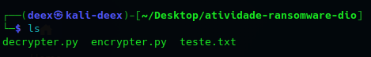

- Mostrando arquivo para teste: ``` nano teste.txt ```

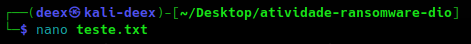

---

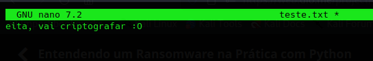

- Criptografando arquivo "teste.txt": ``` python encrypter.py ```
  
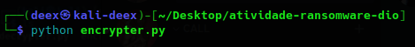

- Arquivo criptografado criado e resultado: ``` ls ```

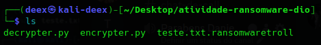

- Resultado da criptografia: ``` nano teste.txt.ransomwaretroll ```

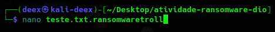

---

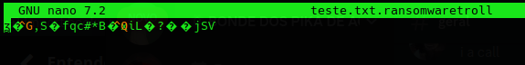

- Descriptografando arquivo: ``` python decrypter.py ```

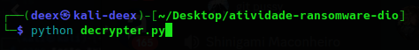

- Arquivo descriptografado de volta: ``` ls ```

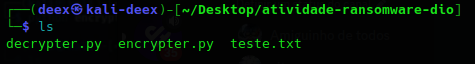

- Resultado descriptografia: ``` nano teste.txt ```

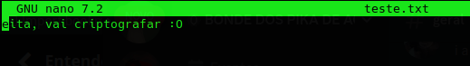

- Print do terminal:

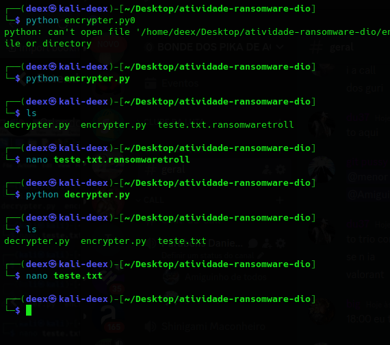


